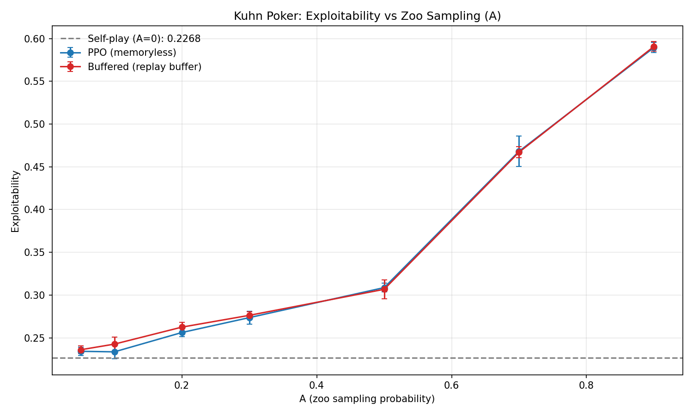
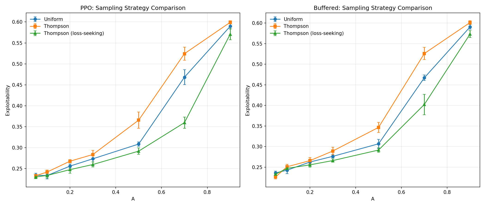
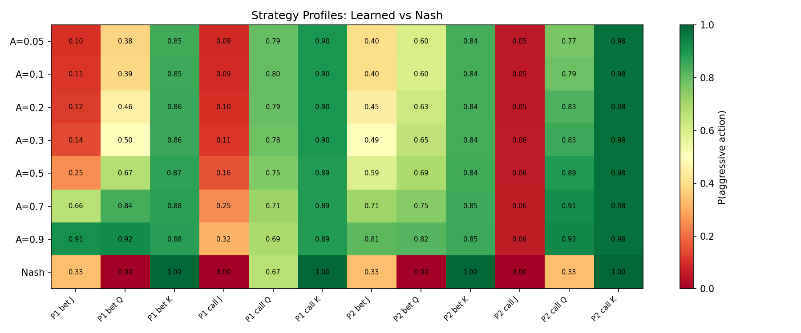
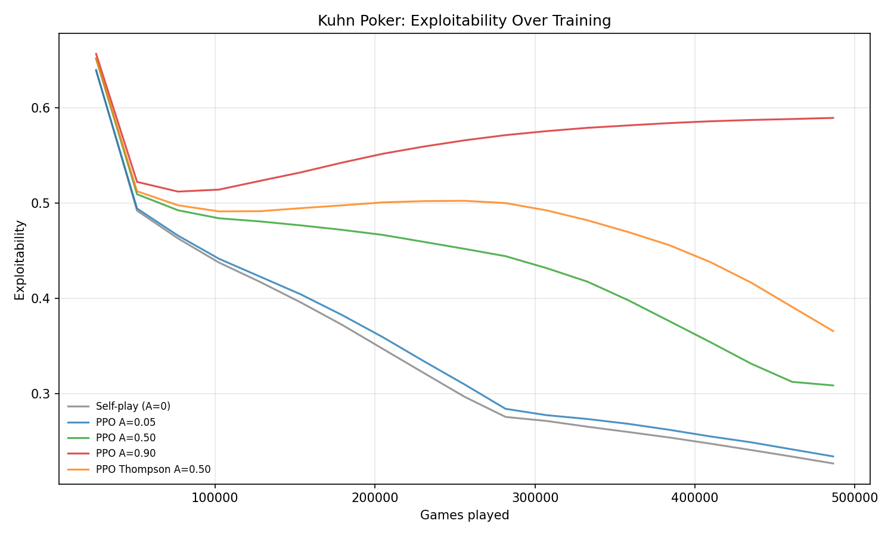

# Kuhn-Poker-RL

A-parameter hypothesis testbed using Kuhn Poker — a sequel to [RPS_RL](https://github.com/kilojoules/RPS_RL) that tests whether the same findings hold in a game with information asymmetry, sequential decisions, and non-trivial Nash equilibrium structure.

**Key finding: every result from RPS reverses, but the fix reveals why.** Zoo sampling hurts convergence, the replay buffer provides no advantage, and standard Thompson Sampling makes things worse. However, a **loss-seeking Thompson** variant — which preferentially selects opponents that *beat* the agent — partially recovers the benefit, reducing exploitability by up to 23% vs uniform at high A. The root cause: in Kuhn Poker, the best response to diverse/random opponents is exploitative, not Nash.

## The A Parameter

A = probability of sampling an opponent from the historical zoo (vs. playing the latest opponent). See [AI-Plays-Tag](https://github.com/kilojoules/AI-Plays-Tag#the-a-parameter) for the full definition and cross-game comparison.

- **A=0**: Self-play — always play latest opponent, no zoo.
- **A in (0, 1)**: Mix of latest opponent + zoo sampling.
- **A near 1**: Almost always sample from zoo.

## The Game

Kuhn Poker is a simplified poker game with a known Nash equilibrium:

- **3-card deck**: Jack (J) < Queen (Q) < King (K)
- **Each player** antes 1 chip, receives one card
- **Player 1** acts first: check or bet (1 chip)
  - If P1 checks → P2: check (showdown) or bet
    - If P2 bets → P1: fold or call
  - If P1 bets → P2: fold or call
- **Showdown**: higher card wins the pot

**Nash equilibrium** (parameterized by α ∈ [0, 1/3]):

| Info Set | Nash (α=1/3) | Description |
|----------|-------------|-------------|
| P1 bet J | 0.33 | Bluff 1/3 of the time |
| P1 bet Q | 0.00 | Never bet Queen |
| P1 bet K | 1.00 | Always value-bet King |
| P1 call J | 0.00 | Always fold Jack to bet |
| P1 call Q | 0.67 | Call 2/3 with Queen |
| P1 call K | 1.00 | Always call with King |
| P2 bet J | 0.33 | Bluff 1/3 after check |
| P2 bet Q | 0.00 | Never bet Queen |
| P2 bet K | 1.00 | Always bet King |
| P2 call J | 0.00 | Always fold Jack |
| P2 call Q | 0.33 | Call 1/3 with Queen |
| P2 call K | 1.00 | Always call with King |

Game value: −1/18 for Player 1. Exploitability at Nash = 0.

**Why Kuhn Poker instead of RPS?** RPS has a degenerate property: Nash equilibrium (uniform 1/3, 1/3, 1/3) is the best response to *any* mixture of opponents. Training against random opponents naturally converges to Nash. Kuhn Poker breaks this — the best response to random opponents involves aggressive betting that exploits their mistakes, which is far from Nash. This makes the zoo's effect on convergence qualitatively different.

## Results

We ran 215 experiments: 7 A values × 2 algorithms (PPO, Buffered) × 3 sampling strategies (Uniform, Thompson, Thompson-Loss) × 5 seeds, plus 5 self-play baselines. All at 500k games with tabular policies (12 logit parameters per agent).

### The A Curve Inverts

In RPS, more zoo = lower exploitability. In Kuhn Poker, **more zoo = higher exploitability**, monotonically:



**PPO (uniform sampling) — 500k games, 5 seeds:**

| Condition | Exploitability (mean ± std) |
|-----------|----------------------------|
| Self-play (A=0) | **0.2268 ± 0.0034** |
| A=0.05 | 0.2342 ± 0.0049 |
| A=0.10 | 0.2335 ± 0.0082 |
| A=0.20 | 0.2561 ± 0.0048 |
| A=0.30 | 0.2736 ± 0.0074 |
| A=0.50 | 0.3087 ± 0.0052 |
| A=0.70 | 0.4682 ± 0.0178 |
| A=0.90 | 0.5896 ± 0.0061 |

**Buffered (uniform sampling) — 500k games, 5 seeds:**

| Condition | Exploitability (mean ± std) |
|-----------|----------------------------|
| A=0.05 | 0.2360 ± 0.0044 |
| A=0.10 | 0.2426 ± 0.0083 |
| A=0.20 | 0.2625 ± 0.0056 |
| A=0.30 | 0.2763 ± 0.0043 |
| A=0.50 | 0.3067 ± 0.0111 |
| A=0.70 | 0.4671 ± 0.0067 |
| A=0.90 | 0.5908 ± 0.0056 |

Self-play (A=0) produces the lowest exploitability at **0.2268** — better than any zoo condition. The A curve rises monotonically: A=0.9 is 2.6× worse than self-play.

### PPO and Buffered Are Identical

Unlike RPS where PPO's curve was steeper than Buffered's, the two algorithms produce **indistinguishable results** in Kuhn Poker. The curves overlap within error bars at every A value.

**Why?** In RPS, the replay buffer's "memory" of past opponents provided diversity that PPO lacked. In Kuhn Poker, that same memory is counterproductive — it reinforces exploitative strategies learned against weak historical opponents. The buffer remembers the *wrong things*.

### Standard Thompson Sampling Hurts

In RPS, Thompson Sampling improved exploitability by 30–69% at high A. In Kuhn Poker, standard Thompson **increases** exploitability by up to 18.5%.

**Why standard Thompson fails:** Thompson selects "competitive" opponents — those producing close matches (`|mean_reward| < threshold`). In Kuhn Poker, an agent that has learned exploitative strategies (e.g., always betting with Queen) will have close matches against other exploitative agents in the zoo. Meanwhile, near-Nash opponents in the zoo would *crush* the exploitative agent (large `|mean_reward|`), so Thompson filters them OUT. Standard Thompson preferentially avoids exactly the opponents that would provide corrective signal toward Nash.

### Loss-Seeking Thompson: The Fix

We introduce **Thompson-Loss**, a variant where "success" is redefined as the agent *losing* (`mean_reward < -threshold`). This inverts the selection pressure: the zoo preferentially samples opponents that beat the agent — exactly the strong opponents that expose exploitative weaknesses and push toward Nash.



**PPO — 3-Way Sampling Comparison (500k games, 5 seeds):**

| A | Uniform | Thompson | Thompson-Loss | Loss vs Uniform |
|---|---------|----------|---------------|-----------------|
| 0.05 | 0.2342 | 0.2330 | **0.2302** | −1.7% |
| 0.10 | 0.2335 | 0.2420 | **0.2338** | +0.1% |
| 0.20 | 0.2561 | 0.2678 | **0.2477** | −3.3% |
| 0.30 | 0.2736 | 0.2838 | **0.2599** | −5.0% |
| 0.50 | 0.3087 | 0.3658 | **0.2918** | **−5.5%** |
| 0.70 | 0.4682 | 0.5242 | **0.3598** | **−23.1%** |
| 0.90 | 0.5896 | 0.5990 | **0.5706** | −3.2% |

**Buffered — 3-Way Sampling Comparison (500k games, 5 seeds):**

| A | Uniform | Thompson | Thompson-Loss | Loss vs Uniform |
|---|---------|----------|---------------|-----------------|
| 0.05 | 0.2360 | 0.2263 | **0.2330** | −1.3% |
| 0.10 | 0.2426 | 0.2509 | **0.2470** | +1.8% |
| 0.20 | 0.2625 | 0.2658 | **0.2556** | −2.6% |
| 0.30 | 0.2763 | 0.2892 | **0.2660** | −3.7% |
| 0.50 | 0.3067 | 0.3466 | **0.2916** | −4.9% |
| 0.70 | 0.4671 | 0.5261 | **0.4023** | **−13.9%** |
| 0.90 | 0.5908 | 0.6014 | **0.5734** | −2.9% |

**Key observations:**
1. **Thompson-Loss beats Uniform at every A value** (for PPO), and nearly every value for Buffered.
2. **The effect is strongest at high A** (A=0.70): Thompson-Loss reduces exploitability by 23% vs Uniform and 31% vs standard Thompson.
3. **The effect peaks at moderate-high A**, not at extremes. At A=0.90, the zoo is so dominant that even smart sampling can't overcome the sheer volume of weak opponents.
4. **Still worse than self-play** (0.2268). Loss-seeking helps, but zoo sampling still hurts overall — the fundamental problem (weak opponents in the zoo) remains.

### Why Loss-Seeking Works (and Why It's Not Enough)

The loss-seeking variant fixes the *selection* problem: it preferentially trains against opponents that expose the agent's weaknesses, pushing the agent toward more robust strategies. At A=0.70, this reduces exploitability from 0.4682 (uniform) to 0.3598 — a 23% improvement.

But loss-seeking doesn't fix the *distribution* problem: the zoo is still filled with weak historical checkpoints. Even with perfect selection, the available opponents are mostly from early training. At A=0.90, 90% of training games are against zoo opponents, so the agent simply doesn't get enough self-play iterations to converge.

This explains the peak at A=0.70: there's enough zoo sampling for Thompson-Loss to have an effect (vs. A=0.05 where zoo is rarely used), but not so much that the agent drowns in weak-opponent data (vs. A=0.90).

### What the Agent Actually Learns

The strategy heatmap reveals exactly how zoo sampling corrupts learning:



The critical failure mode is **P1/P2 bet Q** (Queen betting probability):

| Condition | P1 bet Q | P2 bet Q | Nash |
|-----------|----------|----------|------|
| A=0.05 | 0.38 | 0.60 | **0.00** |
| A=0.50 | 0.67 | 0.69 | **0.00** |
| A=0.90 | 0.92 | 0.82 | **0.00** |

At A=0.9, the agent bets with Queen 92% of the time — it should *never* bet with Queen. Betting with Queen is optimal against weak opponents who fold too much, but catastrophic against competent opponents who call with King.

The zoo is filled with historical checkpoints from early training, when opponents played randomly. Against random opponents, aggressive betting with all cards is profitable. So the agent learns "always bet" — which works against the zoo but is maximally exploitable.

### Training Dynamics



## Why Everything Reverses

The reversal traces to a single structural difference between RPS and Kuhn Poker:

| Property | RPS | Kuhn Poker |
|----------|-----|------------|
| Nash is best response to random? | **Yes** — uniform play is optimal against any opponent mix | **No** — best response to random is exploitative betting |
| Zoo diversity helps? | Yes — diverse opponents = diverse gradients → Nash | No — diverse weak opponents → exploitative strategies |
| Replay buffer helps? | Yes — "remembers" diverse past opponents | No — "remembers" rewards from exploiting weak opponents |
| Standard Thompson helps? | Yes — selects informative opponents | No — selects opponents that don't expose weaknesses |
| Loss-seeking Thompson helps? | Untested (unnecessary — standard already works) | **Yes** — selects opponents that beat the agent, providing corrective signal |

In game theory terms: RPS is a **symmetric** zero-sum game where the minimax strategy coincides with the maximin strategy against any opponent distribution. Kuhn Poker is an **asymmetric information** game where the optimal strategy depends critically on the opponent's skill level. Training against a distribution of weak opponents teaches exploitation, not equilibrium play.

## The Thompson Sampling Inversion

The three Thompson variants tell a coherent story about what "informative" means in different games:

| Strategy | Selection criterion | Works in RPS? | Works in Kuhn? |
|----------|-------------------|---------------|----------------|
| **Uniform** | Random | Baseline | Baseline |
| **Thompson (competitive)** | Prefer close matches | Yes — close matches = opponents near Nash | No — close matches = opponents agent already handles |
| **Thompson (loss-seeking)** | Prefer agent losses | Untested | **Yes** — losses = opponents that expose weaknesses |

In RPS, "competitive" and "informative" are synonymous because Nash is optimal against everything. In Kuhn Poker, they diverge: the most informative opponents are those that beat you, not those you play closely against.

**Implication for zoo-based training in general:** The right Thompson signal depends on the game's structure. In games where Nash is unique and robust, competitiveness works. In games with exploitative equilibria, loss-seeking (or more generally, *worst-case*) sampling is needed.

## Implications for the A-Parameter Hypothesis

**The A-parameter hypothesis — that memoryless algorithms need more zoo sampling — does not hold in Kuhn Poker.** Specifically:

1. **A\* = 0 (self-play) for both algorithms.** The optimal zoo sampling ratio is zero, regardless of sampling strategy. Even Thompson-Loss can't make zoo sampling beat pure self-play.
2. **The replay buffer provides no advantage.** PPO and Buffered produce identical results at every A value, contradicting the hypothesis that "memory capacity" determines sensitivity to zoo sampling.
3. **The benefit of zoo sampling is game-dependent.** It helps in games where Nash is robust to opponent distribution (like RPS) and hurts in games where Nash requires precise adaptation to the opponent (like poker).
4. **Thompson Sampling's value depends on what "informative" means.** Standard Thompson's competitiveness signal is backwards in Kuhn Poker. Loss-seeking Thompson partially fixes this, but the fundamental problem (weak zoo opponents) remains.
5. **Smart sampling helps but doesn't solve the distribution problem.** Thompson-Loss improves over uniform by up to 23%, but still can't overcome a zoo filled with weak checkpoints. The zoo *content* matters more than the zoo *selection*.

**What transfers from RPS to Kuhn Poker:** The qualitative insight that zoo diversity can be destabilizing (observed at high A in RPS's long-horizon experiments) is the *dominant* effect in Kuhn Poker, present at all timescales and all A values.

**What doesn't transfer:** The specific finding that moderate zoo sampling accelerates convergence, that PPO benefits more than buffered agents, and that Thompson Sampling helps at high A.

**What's new in Kuhn Poker:** Loss-seeking Thompson partially recovers zoo utility, suggesting that opponent selection research should focus on *what the agent needs to learn* rather than *what produces close games*.

## Quick Start

```bash
# Install with pixi
pixi install

# Run tests
pixi run test-env

# Self-play baseline
pixi run selfplay

# Single zoo experiment
python train_zoo.py -A 0.1 --timesteps 500000

# Single buffered experiment with loss-seeking Thompson
python train_zoo_buffered.py -A 0.5 --timesteps 500000 --sampling-strategy thompson_loss

# Full sweep (215 experiments, ~70 min)
pixi run sweep

# Analyze results
pixi run analyze
```

## Architecture

- **Policy**: Tabular — 12 logit parameters (one per info set), mapped to action probabilities via softmax. No neural network approximation error.
- **PPO**: On-policy, clipped surrogate, analytic gradients. Memoryless — only trains on current batch.
- **Buffered**: Off-policy with FIFO replay buffer (10k transitions) and truncated importance weights. Provides "memory" of past experience.
- **Zoo**: Stores up to 50 opponent checkpoints. Supports uniform, Thompson (competitive), and Thompson (loss-seeking) sampling.
- **Exploitability**: Exact best-response computation over the full game tree. Verified against known Nash equilibria (exploitability = 0 at α=0 and α=1/3).

## Project Structure

```
Kuhn-Poker-RL/
├── kuhn_env.py            # Game environment + exact exploitability
├── ppo.py                 # Tabular/neural policy + PPO agent
├── buffered_agent.py      # Buffered agent with importance correction
├── zoo.py                 # Opponent zoo + Thompson sampling + schedules
├── train_selfplay.py      # Self-play baseline (A=0)
├── train_zoo.py           # Zoo training for PPO
├── train_zoo_buffered.py  # Zoo training for Buffered
├── run_sweep.py           # Experiment sweep orchestration
├── analyze.py             # Analysis and plotting
├── pyproject.toml         # Pixi project configuration
└── experiments/results/   # Sweep results and plots
```

## Related Projects

This experiment is part of a series investigating zoo sampling and gauntlet-style evaluation across different games:

- **[AI-Plays-Tag](https://github.com/kilojoules/AI-Plays-Tag)** — The flagship experiment. Zoo training improves seeker win rate in 18/20 game configurations, with the largest gains in hard games where catastrophic forgetting is strongest. Contains the canonical definition of the A parameter.
- **[RPS_RL](https://github.com/kilojoules/RPS_RL)** — The cheap testbed that established the A-parameter hypothesis. Zoo sampling breaks co-adaptation cycles in Rock-Paper-Scissors — every finding that inverts here in Kuhn Poker.
- **[REDKWEEN](https://github.com/kilojoules/REDKWEEN)** — Automated LLM red teaming via self-play. Defense always wins; zoo sampling for adversary diversity is an open question.
- **[Adversarial Self-Play for Wind Farm Control](https://julianquick.com/ML/adversarial.html)** — The original motivation: comparing Arms Race, SSP, and Self-Play training topologies for robust wind farm controllers.
